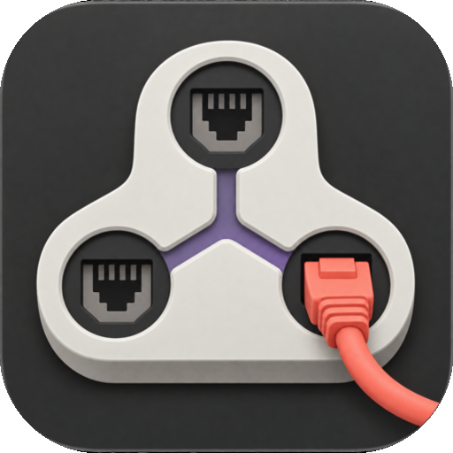

<p align="center">
  
</p>

<h1 align="center">NetToys</h1>

<p align="center">
  Scan your network, keep SSH hosts reachable when their address changes,<br>
  fail over between Wi-Fi networks, and see every outage. A native macOS app.
</p>

<p align="center">
  <a href="#build">Build from source</a> · macOS 15+ · Also built into <a href="https://github.com/surajmandalcell/macpowertoys">MacPowerToys</a> · MIT
</p>

## What it does

- **IP Scanner.** Scan a single address, a range, a CIDR block, a list, or a
  file. Rows fill in as each result arrives: ports, host names, NetBIOS names,
  HTTP servers, and MAC vendors. Sort, filter, search, comment, mark favorites,
  and export to six formats.
- **SSH Anchor.** Keep an SSH host reachable when DHCP gives it a new address.
  NetToys checks the port every few seconds. When the host moves, it finds the
  host again by MAC address or host name and changes only that host's
  `HostName` line in `~/.ssh/config`. It verifies the new address first, keeps a
  backup, and can fall back to Tailscale while the local address is down.
- **Wi-Fi Priority.** Put your saved networks in order. When the current network
  stops working for a time you choose, NetToys joins the next one. Your iPhone
  hotspot stays the last fallback.
- **Network History.** See uptime and every outage for each Wi-Fi network, with
  the exact time and length of each one.
- **Menu bar.** Check the current network, local address, and gateway, start a
  scan, and copy your IP address.

## Setup

1. Build the app (below) and move `NetToys.app` to Applications.
2. Allow **Local Network** access when you first scan. Allow **Location** if you
   want Wi-Fi names; macOS hides network names without it.
3. Turn on monitoring in **Settings**. macOS asks you once to approve the
   NetToys helper in **System Settings → General → Login Items**. The helper
   runs SSH Anchor, Wi-Fi Priority, and Network History while the app is closed.

Settings shows the state of each permission and a button that opens the right
privacy pane.

## Open a page from anywhere

```text
nettoys://open/scanner?targets=192.168.1.0/24&ports=22,443
nettoys://open/ssh-anchor
nettoys://open/wifi
nettoys://open/history
nettoys://open/settings
```

## Use it inside MacPowerToys

MacPowerToys embeds the same NetToys package, so both apps show the same pages,
settings, and data. Data lives in
`~/Library/Application Support/MacPowerToys/NetToys`. Both apps can share one
signed helper. **Take Over Helper** in Settings moves it between apps without
launching the other app.

## Limits

- Scanning and SSH Anchor support IPv4 only.
- macOS starts Instant Hotspot itself. NetToys can only put it last in the
  order; it cannot connect to it.
- Neighbor MAC addresses need the approved helper. Without it, macOS hides them.
- Angry IP Scanner plugins are not supported. Use the built-in custom fetchers
  and openers.

## Build

Requires macOS 15 or later and Swift 6.2 or later.

```sh
swift test --jobs 2
make build            # packages .build/NetToys.app from clean committed source
```

`make build` signs ad hoc by default. Set `SIGNING_IDENTITY` to use your Apple
Development identity. The command does not install or launch the app. Public
distribution needs Developer ID signing and notarization.

## For developers

The package exports `NetToysCore` (no SwiftUI) and `NetToysKit` (windows,
settings, and menu content built with
[OnePlusUI](https://github.com/surajmandalcell/oneplus-ui)). Tests use
synthetic network and SSH files, separate defaults suites, and temporary lock
directories, and render native tables offscreen.

## License

MIT. Copyright 2026 Suraj Mandal. The bundled IEEE vendor registry has its own
terms in its notice file.
